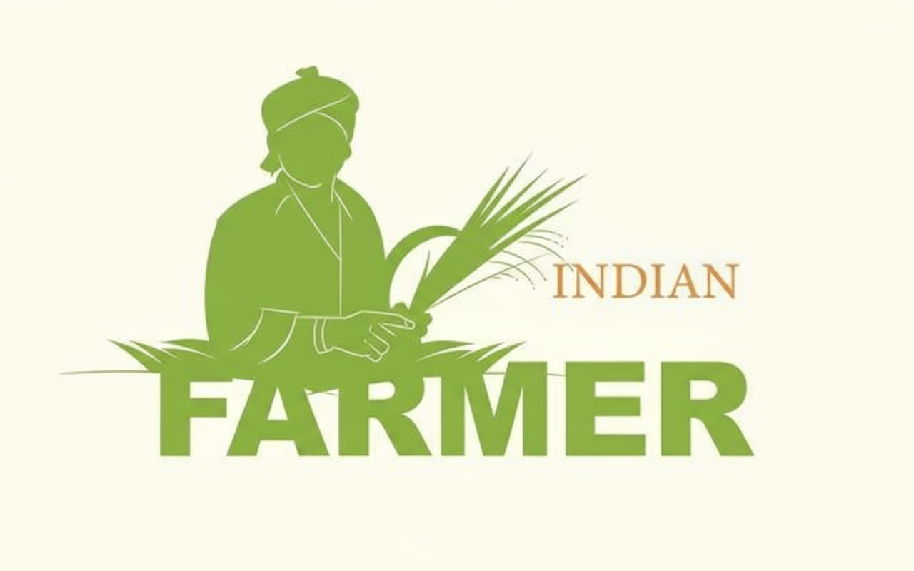

# Smart India Hackathon Workshop
# Date:30.09.2025
## Register Number:25017512
## Name:santhosh kumar s
## Problem Title
SIH 25010: Smart Crop Advisory System for Small and Marginal Farmers
## Problem Description
A majority of small and marginal farmers in India rely on traditional knowledge, local shopkeepers, or guesswork for crop selection, pest control, and fertilizer use. They lack access to personalized, real-time advisory services that account for soil type, weather conditions, and crop history. This often leads to poor yield, excessive input costs, and environmental degradation due to overuse of chemicals. Language barriers, low digital literacy, and absence of localized tools further limit their access to modern agri-tech resources.

Impact / Why this problem needs to be solved

Helping small farmers make informed decisions can significantly increase productivity, reduce costs, and improve livelihoods. It also contributes to sustainable farming practices, food security, and environmental conservation. A smart advisory solution can empower farmers with scientific insights in their native language and reduce dependency on unreliable third-party advice.

Expected Outcomes

• A multilingual, AI-based mobile app or chatbot that provides real-time, location-specific crop advisory.
• Soil health recommendations and fertilizer guidance.
• Weather-based alerts and predictive insights.
• Pest/disease detection via image uploads.
• Market price tracking.
• Voice support for low-literate users.
• Feedback and usage data collection for continuous improvement.

Relevant Stakeholders / Beneficiaries

• Small and marginal farmers
• Agricultural extension officers
• Government agriculture departments
• NGOs and cooperatives
• Agri-tech startups

Supporting Data

• 86% of Indian farmers are small or marginal (NABARD Report, 2022).
• Studies show ICT-based advisories can increase crop yield by 20–30%.

## Problem Creater's Organization
Government of Punjab

## Theme
Agriculture, FoodTech & Rural Development

## Proposed Solution
The proposed solution is a Smart Crop Advisory System that helps farmers make better decisions using digital tools.  
It brings together crop advisory, soil and weather analysis, pest detection, and market insights into one platform.

- Provides personalized crop guidance using soil data and weather updates.  
- Helps address common issues faced by farmers such as unpredictable weather, pest attacks, and unstable market prices.  
- Unique feature: combines AI-driven pest detection with multilingual support, making it farmer-friendly and easy to use.  
- Ensures that even rural farmers with limited digital literacy can benefit from the service via mobile apps and USSD.

## Technical Approach
The system uses a modular design with different services connected through an API Gateway.

- Technologies  
  - Backend: Python (Django/Flask)  
  - Frontend: JavaScript (React)  
  - Databases: PostgreSQL, MongoDB, Redis/Cloud Storage  
  - AI/ML: For pest and disease detection from images  
  - APIs: Weather updates, market price feeds  

- Methodology  
  1. Farmers use the mobile app or USSD service to raise queries.  
  2. Requests go through an API Gateway for routing and authentication.  
  3. The request is sent to the right backend service (crop advisory, pest detection, weather/soil, market monitoring).  
  4. Each service connects to its own database for storing and retrieving information.  
  5. The processed result is sent back to the farmer in a simple and clear format.## Feasibility and Viability
## Feasibility and Viability
Crucial data inputs like Soil Health Card data, IMD weather forecasts, and open-source satellite imagery (Sentinel/Landsat) are available and can be integrated via APIs.

---

### Challenges
Fragmented and Small Landholdings: Due to laws of inheritance, landholdings are continuously being subdivided, leading to small and scattered plots (the average size in India is shrinking). This prevents farmers from achieving economies of scale, making mechanization difficult and increasing the cost of production per unit.

 

---

### Solutions
  Crop Insurance: Widespread adoption and effective implementation of multi-peril crop insurance (e.g., PMFBY) to provide financial compensation for yield losses. Water Management: Promotion of micro-irrigation (drip/sprinkler) and water-harvesting structures. Climate-Resilient Crops: Cultivating drought/flood-tolerant and short-duration varieties.

## Impact and Benefits
Benefit: Achieves economies of scale for procurement and sales, leading to lower input costs and better price realization (higher income). They can also jointly own or lease machinery
### Impact on Farmers
Farmers receive precise recommendations on when to sow, irrigate, and harvest, helping them avoid losses due to guesswork.  

### Social Benefits
Encourages rural communities to adopt digital tools, creating awareness and reducing their dependency on traditional word-of-mouth advice.  

### Economic Benefits
- Lower cultivation costs due to optimized use of resources.  
- Better profit margins through market price comparisons and timely selling decisions.  

### Environmental Benefits
- Promotes sustainable farming by preventing chemical overuse.  
- Conserves water by suggesting irrigation only when required.  

### Diagram

## Research and References
- [World Bank – Digital Agriculture](https://www.worldbank.org/en/topic/agriculture/brief/digital-agriculture)  
- [Indian Council of Agricultural Research (ICAR)](https://icar.org.in/)  
- [Food and Agriculture Organization (FAO)](https://www.fao.org/home/en)  
- [NITI Aayog – Technology in Agriculture](https://www.niti.gov.in/)